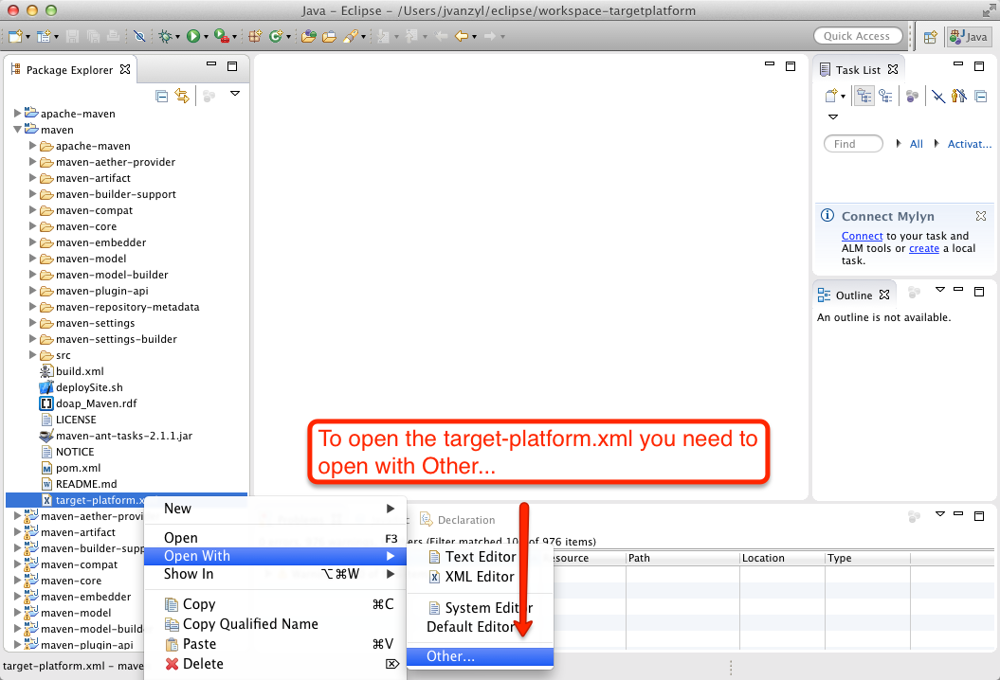
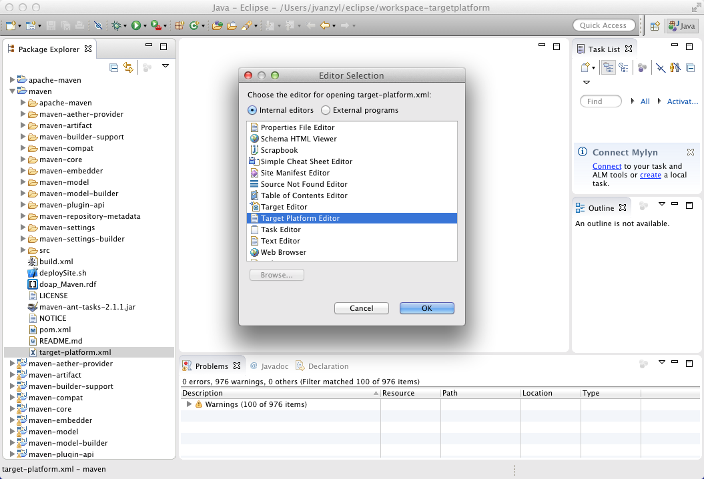
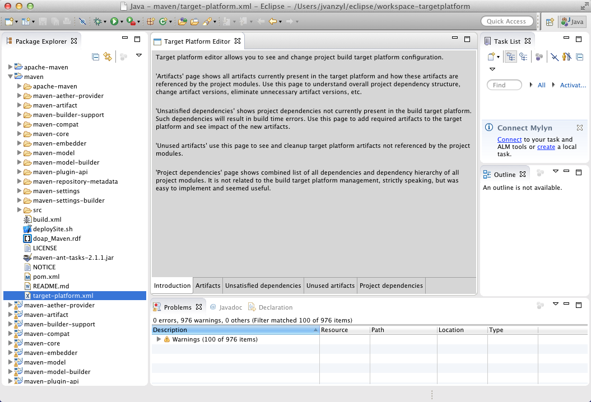

# Takari Target Platform Demo

This is a fork of Maven 3 source tree with basic build target platform configuration.

# Target Platform Editor

## Prerequisites

* Eclipse 4.4/Luna SR1 or 4.5/Mars M5+ SDK, download from http://download.eclipse.org/eclipse/downloads/
* Takari TEAM Eclipse Extensions, install from https://repository.takari.io/content/sites/m2e.extras/takari-team/0.1.0/N/LATEST/
* Takari Build Target Platform Editor, install from https://repository.takari.io/content/sites/m2e.extras/m2eclipse-takari-targetplatform/0.1.0/N/LATEST/

## Eclipse workspace setup

* Import Takari Target Platform Demo, i.e. this project, using `Existing Maven Projects` Eclipse import wizard

## Demo

We recorded a demo of the target platform editor a while back in a [Maven Developer Hangout][1] which might be useful to watch before trying the editor yourself:

<iframe width="560" height="315" src="https://www.youtube.com/embed/jxeWmjUKNwQ?start=58&end=554" frameborder="0" allowfullscreen></iframe>

## Usage

Right-click on target-platform.xml, Open With Other...

 

And then select the Target Platform Editor

 

When the `target-platform.xml` loads you should see the following:

 

[1]: http://takari.io/events.html